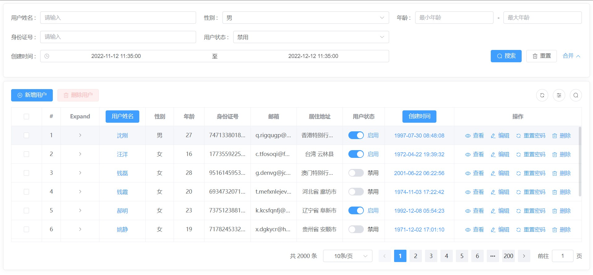
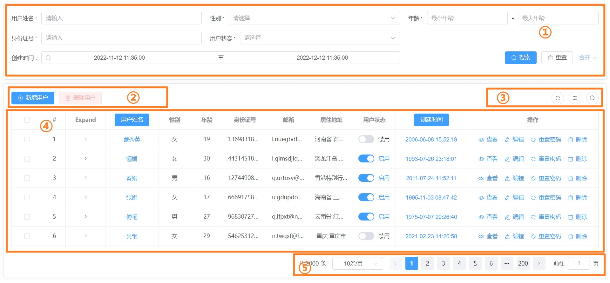

# pro-table
<h4>基于 element-plus 二次封装的通用表格组件</h4>



<br/>

**将页面分成五个部分**



## 功能
> 🕶 ProTable 组件内部通过**属性透传**实现父子组件传值，所以支持 el-table && el-table-column 所有属性、事件、方法的调用，不会有任何心智负担。

- 表格搜索区域使用 Grid 布局，支持自定义响应式配置
- 表格搜索、重置、分页查询、刷新等 hooks 封装（分离状态逻辑和UI逻辑）
- 表格数据多选 hooks 封装 （支持现跨页勾选数据）
- 表格数据刷新、列显隐、列排序、搜索区域显隐设置
- 支持多级表头、表头内容自定义渲染（支持作用域插槽、tsx 语法）
- 支持单元格内容自定义渲染（支持作用域插槽、tsx 语法）
- 支持 el-table && el-table-column 所有属性、事件、方法的调用

## API

### 属性

| 属性名       | 类型        | 是否必传 | 默认值                                | 属性描述                                                     |
| ------------ | ----------- | -------- | ------------------------------------- | ------------------------------------------------------------ |
| columns      | ColumnProps | ✅        | —                                     | ProTable 组件会根据此字段渲染搜索表单与表格列，详情见 Columns 配置 |
| data         | Array       | ❌        | —                                     | 静态 table data 数据，若存在则不会使用 requestApi 返回的 data |
| requestApi   | Function    | ❌        | —                                     | 获取表格数据的请求 API                                       |
| requestAuto  | Boolean     | ❌        | true                                  | 表格初始化是否自动执行请求 API                               |
| requestError | Function    | ❌        | —                                     | 表格 API 请求错误监听                                        |
| dataCallback | Function    | ❌        | —                                     | 后台返回数据的回调函数，可对后台返回数据进行处理             |
| title        | String      | ❌        | —                                     | 表格标题，目前只在打印的时候用到                             |
| pagination   | Boolean     | ❌        | true                                  | 是否显示分页组件：pagination 为 false 后台返回数据应该没有分页信息 和 list 字段，data 就是 list 数据 |
| initParam    | Object      | ❌        | {}                                    | 表格请求的初始化参数，该值变化会自动请求表格数据             |
| toolButton   | Boolean     | ❌        | true                                  | 是否显示表格功能按钮                                         |
| rowKey       | String      | ❌        | 'id'                                  | 当表格数据多选时，所指定的 id                                |
| searchCol    | Object      | ❌        | { xs: 1, sm: 2, md: 2, lg: 3, xl: 4 } | 表格搜索项每列占比配置                                       |


### Columns 配置

| 属性名       | 类型               | 是否必传 | 默认值 | 属性描述                                                     |
| ------------ | ------------------ | -------- | ------ | ------------------------------------------------------------ |
| tag          | Boolean            | ❌        | false  | 当前单元格值是否为标签展示，可通过 enum 数据中 tagType 字段指定 tag 类型 |
| isShow       | Boolean            | ❌        | true   | 当前列是否显示在表格内(只对 prop 列生效)                     |
| search       | SearchProps        | ❌        | —      | 搜索项配置，详情见 Search 配置                               |
| enum         | Object \| Function | ❌        | —      | 字典，可格式化单元格内容，还可以作为搜索框的下拉选项（字典可以为 API 请求函数，内部会自动执行） |
| isFilterEnum | Boolean            | ❌        | true   | 当前单元格值是否根据 enum 格式化（例如 enum 只作为搜索项数据，不参与内容格式化） |
| fieldNames   | Object             | ❌        | —      | 指定 label && value && children 的 key 值                    |
| headerRender | Function           | ❌        | —      | 自定义表头内容渲染（tsx 语法、h 语法）                       |
| render       | Function           | ❌        | —      | 自定义单元格内容渲染（tsx 语法、h 语法）                     |
| _children    | ColumnProps        | ❌        | —      | 多级表头                                                     |


### Search 配置

目前支持的组件：

el-input, el-input-number, el-select, el-select-v2, el-tree-select, el-cascader, 

el-date-picker, el-time-picker, el-switch, el-slider

| 属性名       | 类型     | 是否必传 | 默认值 | 属性描述                                                     |
| ------------ | -------- | -------- | ------ | ------------------------------------------------------------ |
| el           | String   | ❌        | —      | 当前项搜索框的类型，支持：input、input-number、select、select-v2、tree-select、cascader、date-packer、time-picker、time-select、switch、slider |
| props        | Object   | ❌        | —      | 根据 element plus 官方文档来传递，该属性所有值会透传到组件   |
| defaultValue | Any      | ❌        | —      | 搜索项默认值                                                 |
| key          | String   | ❌        | —      | 当搜索项 key 不为 prop 属性时，可通过 key 指定               |
| order        | Number   | ❌        | —      | 搜索项排序（从小到大）                                       |
| span         | Number   | ❌        | 1      | 搜索项所占用的列数，默认为 1 列                              |
| offset       | Number   | ❌        | —      | 搜索字段左侧偏移列数                                         |
| render       | Function | ❌        |        | 自定义搜索内容渲染（tsx 语法、h 语法）                       |


### 事件

> ProTable 组件内部通过**属性透传**实现父子组件传值，所以支持 el-table && el-table-column 所有事件的调用
>
> [el-table](https://element-plus.org/zh-CN/component/table.html#table-%E4%BA%8B%E4%BB%B6)


### 方法

| 方法名          | 描述                                                         |
| --------------- | ------------------------------------------------------------ |
| element         | `el-table` 实例，可以通过`proTable.value.element.方法名`来调用 `el-table` 的所有方法 |
| tableData       | 当前页面所展示的数据                                         |
| searchParam     | 所有的搜索参数，不包含分页                                   |
| searchInitParam | 所有的搜索初始化默认的参数                                   |
| pageable        | 当前表格的分页数据                                           |
| getTableList    | 获取、刷新表格数据的方法（携带所有参数）                     |
| search          | 表格查询方法，相当于点击搜索按钮                             |
| reset           | 重置表格查询参数，相当于点击重置按钮                         |
| clearSelection  | 清空表格所选择的数据，除此方法之外还可使用 `proTable.value.element.clearSelection()` |
| enumMap         | 当前表格使用的所有字典数据（Map 数据结构）                   |
| isSelected      | 表格是否选中数据                                             |
| selectedList    | 表格选中的数据列表                                           |
| selectedListIds | 表格选中的数据列表的 id                                      |


### 插槽

| 插槽名                   | 描述                                                         |
| ------------------------ | ------------------------------------------------------------ |
| —                        | 默认插槽，支持直接在 ProTable 中写 el-table-column 标签      |
| tableHeader              | 自定义表格头部左侧区域的插槽，一般情况该区域放操作按钮       |
| toolButton               | 自定义表格头部左右侧侧功能区域的插槽                         |
| append                   | 插入至表格最后一行之后的内容， 如果需要对表格的内容进行无限滚动操作，可能需要用到这个 slot。 若表格有合计行，该 slot 会位于合计行之上。 |
| empty                    | 当表格数据为空时自定义的内容                                 |
| pagination               | 分页组件插槽                                                 |
| `column.prop`            | 单元格的作用域插槽                                           |
| `column.prop` + "Header" | 表头的作用域插槽                                             |


## 使用

```vue
<script setup lang="tsx" name="useProTable">
import ProTable from '@/components/ProTable/index.vue';
import { getUserList } from '@/api/index'
import { ColumnProps, HeaderRenderScope, ProTableInstance } from './components/ProTable/interface';
import { ElMessage } from 'element-plus';
import { CirclePlus, Delete, EditPen, View, Refresh } from "@element-plus/icons-vue";
import { ref, reactive, computed } from 'vue';

interface ResUserList {
  id: string;
  username: string;
  gender: number;
  user: { detail: { age: number } };
  idCard: string;
  email: string;
  address: string;
  createTime: string;
  status: number;
  avatar: string;
  photo: any[];
  children?: ResUserList[];
}

const proTable = ref<ProTableInstance>();

const initParam = reactive({ type: 1 });

const headerRender = (scope: HeaderRenderScope<ResUserList>) => {
  return (
    <el-button type="primary" onClick={() => ElMessage.success("我是通过 tsx 语法渲染的表头")}>
      {scope.column.label}
    </el-button>
  );
};

const selected = computed(() => proTable.value?.selectedList)
console.log('Protable暴露出来的属性和方法', proTable)
console.log('勾选的数据', selected)

const dataCallback = (data: any) => {
  const result =  {
    list: data.data.list,
    total: data.data.total,
    pageNum: data.data.pageNum,
    pageSize: data.data.pageSize
  };
  console.log('data', result)
  return result
};

const getTableList = (params: any) => {
  let newParams = JSON.parse(JSON.stringify(params));
  newParams.createTime && (newParams.startTime = newParams.createTime[0]);
  newParams.createTime && (newParams.endTime = newParams.createTime[1]);
  delete newParams.createTime;
  return getUserList(newParams);
};

// 表格配置项
const columns: ColumnProps<ResUserList>[] = [
  { type: "selection", fixed: "left", width: 50 },
  { type: "index", label: "#", width: 50 },
  { type: "expand", label: "Expand", width: 100 },
  {
    prop: "username",
    label: "用户姓名",
    search: { el: "input" },
    render: scope => {
      // 自定义渲染内容
      return (
        <el-button type="primary" link onClick={() => ElMessage.success("我是通过 tsx 语法渲染的内容")}>
          {scope.row.username}
        </el-button>
      );
    }
  },
  {
    prop: "gender",
    label: "性别",
    // 字典数据
    // enum: genderType,
    // 字典请求不带参数
    enum: [{genderLabel: "男", genderValue: 1}, {genderLabel: "女", genderValue: 2}],
    // 字典请求携带参数
    // enum: () => getUserGender({ id: 1 }),
    search: { el: "select", props: { filterable: true } },
    fieldNames: { label: "genderLabel", value: "genderValue" }
  },
  {
    // 多级 prop
    prop: "user.detail.age",
    label: "年龄",
    search: {
      // 自定义 search 显示内容
      render: ({ searchParam }) => {
        return (
          <div style={{ display: 'flex', justifyContent: 'center', alignItems: 'center' }}>
            <el-input vModel_trim={searchParam.minAge} placeholder="最小年龄" />
            <span style={{ marginRight: '10px', marginLeft: '10px' }}>-</span>
            <el-input vModel_trim={searchParam.maxAge} placeholder="最大年龄" />
          </div>
        );
      }
    }
  },
  { prop: "idCard", label: "身份证号", search: { el: "input" } },
  { prop: "email", label: "邮箱" },
  { prop: "address", label: "居住地址" },
  {
    prop: "status",
    label: "用户状态",
    enum: [{userLabel: "启用", userStatus: 1}, {userLabel: "禁用", userStatus: 0}],
    search: { el: "tree-select", props: { filterable: true } },
    fieldNames: { label: "userLabel", value: "userStatus" },
    render: scope => {
      // 自定义渲染内容
      return (
        <>
        {/* 这里是使用了自定义指令实现权限校验，这里省略 */}
          {true ? (
            <el-switch
              model-value={scope.row.status}
              active-text={scope.row.status ? "启用" : "禁用"}
              active-value={1}
              inactive-value={0}
              onClick={() => changeStatus(scope.row)}
            />
          ) : (
            <el-tag type={scope.row.status ? "success" : "danger"}>{scope.row.status ? "启用" : "禁用"}</el-tag>
          )}
        </>
      );
    }
  },
  {
    prop: "createTime",
    label: "创建时间",
    headerRender,
    width: 180,
    search: {
      el: "date-picker",
      span: 2,
      props: { type: "datetimerange", valueFormat: "YYYY-MM-DD HH:mm:ss" },
      defaultValue: ["2022-11-12 11:35:00", "2022-12-12 11:35:00"]
    }
  },
  { prop: "operation", label: "操作", fixed: "right", width: 330 }
];

//改变用户状态: 启用/禁用
const changeStatus = (row: any) => {
  ElMessage.success(`row:` + row)
}

const addUser = () => {
  ElMessage.success('新增用户')
}
const deleteUser = (row: any) => {
  ElMessage.success('删除用户' + row)
}
const openDrawer = (option: any,row: any) => {
  ElMessage.success(option + row)
}
const resetPass = (row: any) => {
  ElMessage.success('重置密码' + row)
}
const deleteAccount = (row: any) => {
  ElMessage.success('删除' + row)
}
</script>

<template>
<div class="content-box">

  <ProTable
    ref="proTable"
    title="用户列表"
    :columns="columns"
    :request-api="getTableList"
    :init-param="initParam"
    :data-callback="dataCallback"
  >
    <!-- 表格 header 按钮 -->
    <template #tableHeader="scope">
      <el-button type="primary" :icon="CirclePlus" @click="addUser()"> 新增用户 </el-button>
      <el-button type="danger" :icon="Delete" plain :disabled="!scope.isSelected" @click="deleteUser(scope.selectedListIds)">
        删除用户
      </el-button>
    </template>
    <!-- Expand -->
    <template #expand="scope">
      {{ scope.row }}
    </template>
    <!-- usernameHeader -->
    <template #usernameHeader="scope">
      <el-button type="primary" @click="ElMessage.success('我是通过作用域插槽渲染的表头')">
        {{ scope.column.label }}
      </el-button>
    </template>
    <!-- createTime -->
    <template #createTime="scope">
      <el-button type="primary" link @click="ElMessage.success('我是通过作用域插槽渲染的内容')">
        {{ scope.row.createTime }}
      </el-button>
    </template>
    <!-- 表格操作 -->
    <template #operation="scope">
      <el-button type="primary" link :icon="View" @click="openDrawer('查看', scope.row)"> 查看 </el-button>
      <el-button type="primary" link :icon="EditPen" @click="openDrawer('编辑', scope.row)"> 编辑 </el-button>
      <el-button type="primary" link :icon="Refresh" @click="resetPass(scope.row)"> 重置密码 </el-button>
      <el-button type="primary" link :icon="Delete" @click="deleteAccount(scope.row)"> 删除 </el-button>
    </template>
  </ProTable>
  <div>{{ selected }}</div>
</div>
</template>
```


